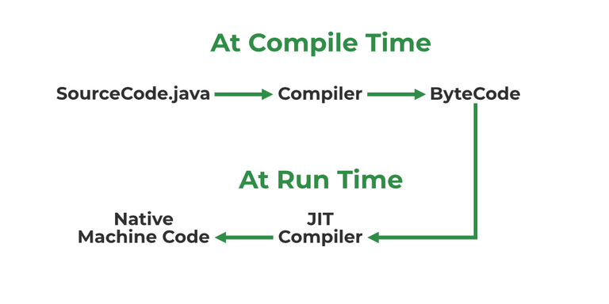

# Java

* Java is a platform independent language
* Javac compiles the program to form a bytecode or .class file .
* JVM mush be on the device in OS for furthur execution of the byte code

## Features of JAVA

* Simpicity
* Platform independent
* Interpreted: Java is intepreted as well as a compiler-based language.
* Robust Language: features like garbage collection,exception handling ,etc that make the language robust
* Object Oriented Language(OOPS)
* High Performance 
* Dynamic: Supports dynamic loading of classes and interfaces
* Multithreaded: deal with multiple tasks at once by defining multiple threads

## JVM(JAVA VIRTUAL MACHINE)

 JVM is a java interpreter , reponsible for loading,verifying, and executing the bytecode created in Java.

 ## JIT(Just - In - Time)

 Jit compiler is a part of JRE(JAVA RUNTIME ENVIRONMENT), used for better performance of java applications during runtime

 ### Use of JIT step by step

* Source code is compiled with javac to form bytecode
* Bytecode is further passed on to JVM
* JIT is a part of JVM, JIT is responsible for compiling bytecode into natice machine code at run time.

* When a method (a block of code) is invoked (called) for the first time, the JIT compiler kicks in. It compiles the method into machine code, which is much faster to execute. This compilation step happens just in time, hence the name Just-In-Time compiler.

## Memory Storages with JVM

* Class(Method) Area: Class Area is a memory in JVM that storeds information about classes and methods.

* Heap : Objects are created or objects are stored. Used to Allocate memory to objects during run time.

* Stack :Stores data and partial results 

* Program Counter Register: The PCR ensures that the JVM knows exactly where it is in the program and what instruction to execute next. This allows the JVM to run the program correctly and efficiently.

* Native method stack : The Native Method Stack stores native methods (code written in languages like C or C++) used in a Java application, allowing the JVM to interact with the operating system, hardware, or external systems when needed.

## Class Loader

ClassLoader is a part of JRE, during the execution of the bytecode or created .class file CLASSLOADER is responsible for dynamically loading the java classes and interfaces to JVM.Because of classloaders java run time system does not need to know about files and file system.

## Difference between JVM , JRE and JDK

### JVM
* Type of interpreter responsible for converting bytecode into machine-readable code.
* JVM itself is platform dependent but it interprets the bytecode which is the platform-independent reason why java is platform-independet

### JRE
* An installation package that provides an environment to run the java program or application on any machine

### JDK
 * Java development kit which provides the environment to develop and execute java programs. 
 * JDK provdies two things 
 1) Development tools to provide an envirnoment to develop you java programs 
 2) JRE  to execute java programs or applications

# C++ vs Java: Key Differences
=====================================

## Platform

|  | C++ | Java |
| --- | --- | --- |
| Platform Dependence | Dependent | Independent |

## Programming Focus

|  | C++ | Java |
| --- | --- | --- |
| Main Use Case | System Programming | Application Programming |

## Hardware Interaction

|  | C++ | Java |
| --- | --- | --- |
| Hardware Interaction | Nearer to hardware | Not so interactive with hardware |

## Scope

|  | C++ | Java |
| --- | --- | --- |
| Global Scope | Supported | Not Supported |
| Namespace Scope | Supported | Not Supported |

## Functionality

### Supported in Java but not in C++

| Functionality |
| --- |
| Thread Support |
| Documentation Comment |
| Unsigned Right Shift (`>>>`) |

### Supported in C++ but not in Java

| Functionality |
| --- |
| Goto |
| Pointers |
| Call by Reference |
| Structures and Unions |
| Multiple Inheritance |
| Virtual Functions |
| OOPS |

## Object-Oriented Programming

|  | C++ | Java |
| --- | --- | --- |
| Object-Oriented Language | Yes | Yes |
| Inheritance Hierarchy | Multiple roots | Single root (java.lang.Object) |

## Inheritance Tree

|  | C++ | Java |
| --- | --- | --- |
| Inheritance Tree | Creates a new tree | Uses a single inheritance tree |

